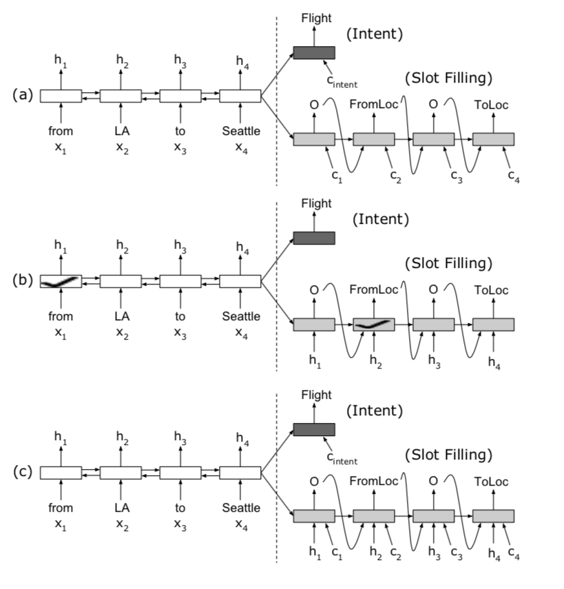
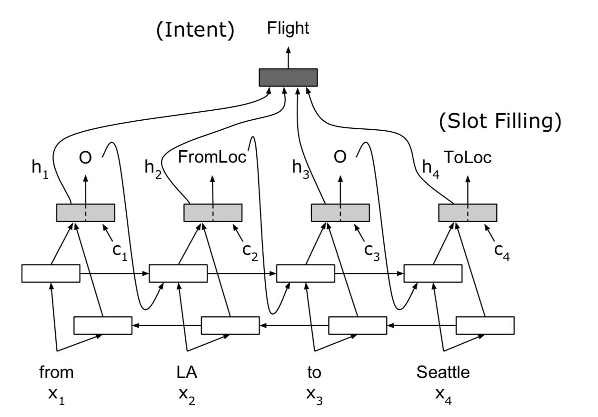

# 论文笔记：【Attention-Based RNN】

> [Attention-Based Recurrent Neural Network Models for Joint Intent Detection and Slot Filling](http://arxiv.org/abs/1609.01454)

## 一、Abstract

Attention-based Encoder-Decoder 模式在机器翻译和语音识别领域都有很好的效果，而这篇论文则是将Attention-based Encoder-Decoder模式应用在SlotFilling和IntentDetection任务上，并创建联合模型来提升鲁棒性，并达到了state-of-the-art的效果。

这里需要注意的一点就是，在SlotFilling中，预测序列标注是和文本序列对齐，长度一致的。故本论文模型使用的架构与以前基于注意力机制的Encoder-Decoder模式不一样，采取了alignment-based RNN模型。

## 二、Introduction

在处理SlotFilling和IntentDetection这两个任务的时候，在此论文发表之前，一般都是分开单独训练成两个模型。其中Slotfilling相当于序列标注问题，使用的方法也很多，如最大熵马尔科夫模型（MEMM）、条件随机场（CRF）、循环神经网络（RNN）等。IntentDetection相当于语义文本分类问题，使用的方法有支持向量机（SVM）、（深度神经网络）DNN等。

将两个任务融合成一个，最终生成一个模型，故简化了SLU系统的复杂度。

Encoder-Decoder在很多领域都能够拥有一个很好的效果，究其原因在于：Encoder能够就一个序列文本编码成一个低纬度空间向量，然后根据这个空间向量，生成输出序列，完成一个信息提取压缩的过程。

那将Attention添加到Encoder和Decoder中间，能够增强模型知识学习的能力，突出重点信息，减少干扰信息，以便Decoder能够更好的从低纬度空间向量中学习。

在Attention-based Encoder-Decoder模型中，**即使是面对不同长度的文本且不存在对齐标注信息时，都能够很好的完成序列信息提取。** 可是在SlotFilling任务中，对齐标注信息是必须要具备的，所以本论文提出**Alignment-based Encoder-Decoder**情理之中获得了非常好的效果，同时作者也做了将Attention-based和Alignment-based两种方法融合在一起的工作，并通过实验来证明将这两种方法用在SlotFilling和IntentDetection的融合模型上是非常可行的。

## 三、Background

### 2.1 RNN for SlotFilling

在SlotFilling任务中，文本序列长度与序列标注的长度一致并对齐，例如：

| sentence   | first | class | fares| from| boston| to| denver|
| :-: | :-: | :-: | :-: | :-: | :-: | :-: | :-: |
| slot |B-class_type|I-class_type| O|O|B-fromloc|O|B-toloc|
|intent| airfare |

以上为论文在ATIS数据集中摘取的示例数据。

RNN在处理长序列问题非常有效，故在自然语言处理任务中是无处不在。在每个timestep中，RNN读取一个单词（向量）作为输入，同时依据保存的历史信息，预测与之对应的序列标注类型。

在损失函数的角度上来看，主要是为了寻找一个最好参数$\theta$以最大化似然估计：
$$
arg max \prod_{t=1}^{T} P(y_t|y_{1}^{t-1},x;\theta)
$$

从整体上看槽填充任务，公式如下：
$$
\hat{y} = argmax P(y|x)
$$

### 2.2 RNN Encoder-Decoder

在IntentDetection任务中，将输入序列编码成一个向量$c$（Sequence2Vector模型），故将整个文本序列信息编码成一个低纬向量空间数据，并依此向量来生成目标序列向量。

公式如下所示：

$$
P(y) = \prod_{t=1}^{T} P(y_t|y_1^{t-1}, c)
$$

与RNN模型相比，**RNN Encoder-Decoder 在不同长度的文本映射上效果更好**，在源文本和目标文本的长度之间没有明确的对齐关系。有人说，那既然这样，这个模型就不能够用在SlotFilling任务上了。

没错，可是接下来作者会介绍Attention-base Encoder-Decoder模式就能够解决这个问题。

## 四、Proposed Model

作者使用了多种方法来探索在SlotFilling和IntentDetection任务上的Encoder-Decoder对齐文本信息机制。

### 4.1 Encoder-Decoder Model with Aligned Inputs

首先使用Encoder-Decoder模型在对齐文本上的实验。

总共使用了三种方法，如上图所示。

- (a): 没有对齐数据
- (b): 有对齐数据
- (c): 有对齐数据和attention数据

在Encoder这边，使用了LSTM作为基础循环神经单元以更好的捕捉到序列历史信息。

对于SlotFilling任务，主要是将一个单词序列（$X=(x_1,x_2,...x_T)$）映射到一个标签序列（$Y=(y_1,y_2,...y_T)$）上，双向RNN Encoder-Decoder能够捕捉到双向上下文信息。

在双向LSTM Encoder的最后一个隐藏层输出上，包含了整个文本的前后向上下文信息。

可是在Decoder没有使用双向循环神经网络，可也是使用LSTM来作为基础神经单元。在Decoder每一个时间序列 $i$ 上，当前LSTM单元的状态 $s_i$ 由前一个单元的状态 $s_{i-1}$ ，和前一个隐藏层输出 $y_{i-1}$ ，还有还融合Encoder的隐藏层输出数据 $h_i$ ,最后还有上下文向量 $c_i$ ：

$$
s_i = f(s_{i-1}, y_{i-1}, h_i, c_i)
$$

以上参数中，$c_i$ 是通过Encoder的隐藏序列状态($h=(h_1,h_2,...h_T)$)计算而来：

$$
c_i = \sum_{j=1}^{T} a_{i,j} h_j
$$

同时：

$$
a_{i,j} = \frac{exp(e_{i,j})}{\sum_{k=1}^{T}exp(e_{i,k})}
$$

$$
e_{i,j} = g(s_{i-1}, h_j)
$$

其中$g$就是一个Feedforward函数，在每个时间步上，对齐数据为Encoder的隐藏输出层$h_i$，而$c_i$可以看作是融合了$(h_1,h_2,...h_T)$的上下文数据，能够有针对性的在每个时间步上获取全局上下文数据。

对于SL和ID两个任务，通过融合模型共享Encoder，提取出两个任务的相似信息。在训练阶段，两个任务的损失值通过decoder将梯度反向传递到encoder中。

> 细心的朋友会注意到$c_{intent}$ 和 intent_decoder的初始值问题。前者是通过Encoder的输出计算而来的上下文数据，而后者是与SL的decoder共享初始值$s_0$，这个关键点在实际编码的过程中要注意。

### 4.2 Attention-based RNN model

模型结构图如下所示：

在这个模型中，没有使用Encoder-Decoder模式，而是直接使用BiRNN来对原始文本数据进行编码，提取出序列标签数据，同时通过注意力机制获取的上下文变量$c_i$也在RNN中进行融合训练，增强数据的关联性。

为啥要用Attention机制呢？

因为在RNN中虽然能够很好的记住历史信息，可还是会随着步数的增加而减弱之前的信息，于是在处理SL任务时，就会损失部分信息。加上$c_{context}$信息之后，能够很好的捕捉到全局文本的相关信息。

当然也是可以将Attention-based 和Encoder-Decoder模式结合在一起，达到了state-of-the-art的效果。

## 5、Conclusion

提出了Joint Attention-based Encoder Decoder模型，刷新了ATIS数据集上的SL和ID的准确率。
