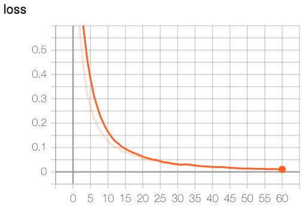
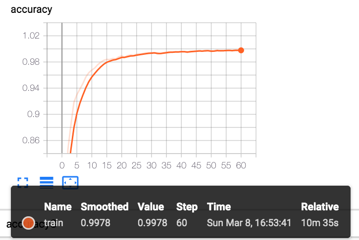

# experiment record

- 模型： IntentDetectionModel

## param-1


- 参数

```json
"model": 
{
    "type": "intent_detection",
    "text_field_embedder": {
        "token_embedders": {
            "tokens": {
                "type": "embedding",
                "embedding_dim": 100
            },
            "token_characters": {
                "type": "character_encoding",
                "embedding": {
                    "embedding_dim": 60
                },
                "encoder": {
                    "type": "cnn",
                    "embedding_dim": 60,
                    "num_filters": 64,
                    "ngram_filter_sizes": [3]
                },
                "dropout": 0.1
            }
        }
    },
    "encoder": {
        "type": "lstm",
        "bidirectional": true,
        "input_size": 164,
        "hidden_size": 100,
        "num_layers": 1,
        "dropout": 0.2
    },
    "feed_forward": {
        "input_dim": 200,
        "num_layers": 2,
        "hidden_dims": [
            75,
            26
        ],
        "activations": [
            "relu",
            "linear"
        ],
        "dropout": [
            0.2,
            0.0
        ]
    }
},
```

- results

```text
accuracy: 0.9972, accuracy3: 0.9994, loss: 0.0120 ||: 100%|##########| 78/78 [00:10<00:00,  7.40it/s]
accuracy: 0.9978, accuracy3: 0.9992, loss: 0.0122 ||: 100%|##########| 78/78 [00:10<00:00,  7.32it/s]
accuracy: 0.9980, accuracy3: 0.9996, loss: 0.0099 ||: 100%|##########| 78/78 [00:10<00:00,  7.32it/s]
accuracy: 0.9970, accuracy3: 0.9994, loss: 0.0128 ||: 100%|##########| 78/78 [00:10<00:00,  7.38it/s]
accuracy: 0.9982, accuracy3: 0.9994, loss: 0.0114 ||: 100%|##########| 78/78 [00:10<00:00,  7.27it/s]
accuracy: 0.9980, accuracy3: 0.9996, loss: 0.0097 ||: 100%|##########| 78/78 [00:10<00:00,  7.37it/s]
accuracy: 0.9978, accuracy3: 0.9996, loss: 0.0097 ||: 100%|##########| 78/78 [00:10<00:00,  7.28it/s]
```

- train-loss



- accuarcy



- 结论

融合Word-level 和 character-level 特性。
单模型训练很容易过拟合


## param-2

- 参数

```json
{
    "dataset_reader": {
        "type": "atis_reader",
        "token_indexers": {
            "tokens": {
                "type": "single_id",
                "lowercase_tokens": true
            }
        }
    },
    "train_data_path": "./dataset/atis/atis.train.pkl",
    "test_data_path": "./dataset/atis/atis.test.pkl",
    "model": {
        "type": "intent_detection",
        "text_field_embedder": {
            "token_embedders": {
                "tokens": {
					"type": "embedding",
					"embedding_dim": 100
				}
            }
        },
        "encoder": {
            "type": "lstm",
            "bidirectional": true,
            "input_size": 100,
            "hidden_size": 100,
            "num_layers": 1,
            "dropout": 0.2
        },
        "feed_forward": {
            "input_dim": 200,
            "num_layers": 2,
            "hidden_dims": [
                75,
                26
            ],
            "activations": [
                "relu",
                "linear"
            ],
            "dropout": [
                0.2,
                0.0
            ]
        }
    },
    "iterator": {
        "type": "bucket",
        "sorting_keys": [
            [
                "sentence",
                "num_tokens"
            ]
        ],
        "batch_size": 64
    },
    "trainer": {
        "num_epochs": 60,
        "patience": 10,
        "cuda_device": -1,
        "grad_clipping": 5.0,
        "validation_metric": "+accuracy",
        "optimizer": {
            "type": "adagrad"
        }
    }
}
```

通过对比参数的不同，可以发现，只是去掉了character-level的input特征提取，对